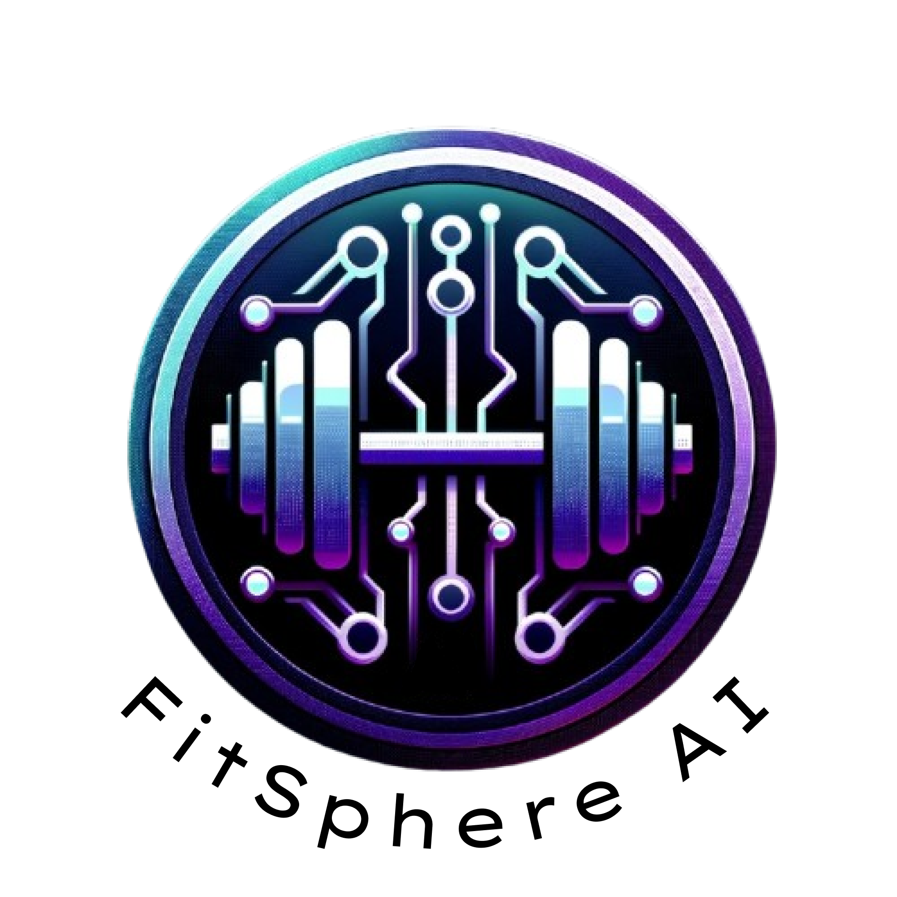
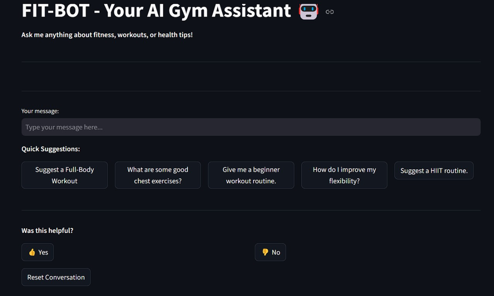
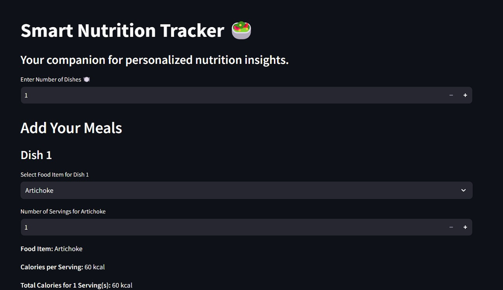
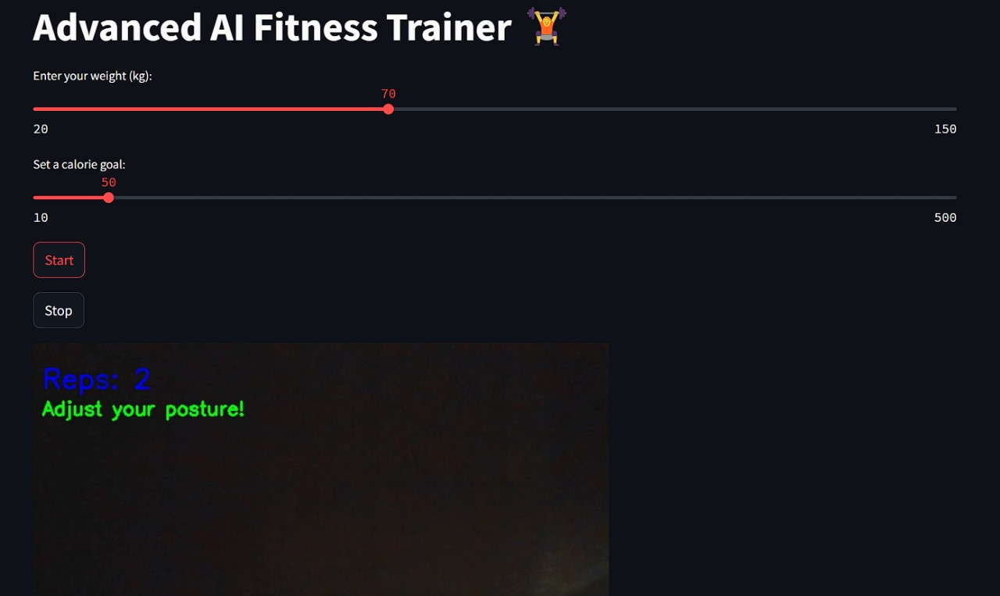
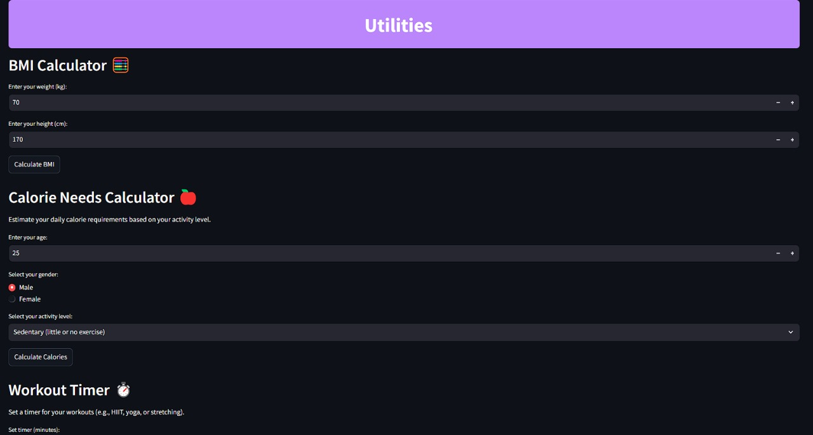

# **FitSphere AI 💪**

  

> **Your Ultimate AI-Powered Fitness Companion**
>
> **FitSphere AI** revolutionizes fitness with personalized AI-driven insights, virtual training, and interactive features.

---

## 🚀 **About FitSphere AI**
FitSphere AI is designed to make fitness accessible, engaging, and effective for everyone. With AI-powered tools and features, it transforms how you plan workouts, track nutrition, and monitor progress. Whether you're at home or on the go, FitSphere AI is your gym partner, trainer, and motivator all in one!

---

## 🎯 **Features At a Glance**

| **Feature**               | **Description**                                                                                     | **UI Preview**                                |
|---------------------------|-----------------------------------------------------------------------------------------------------|-----------------------------------------------|
| **AI Fitness Trainer**     | Personalized workout sessions with real-time pose detection and progress tracking.                 |  |
| **Smart Nutrition Tracker** | Tracks meals and provides detailed calorie and nutrient analysis.                                  |  |
| **AI Gym Assistant**        | A chatbot to answer all your fitness-related queries and provide workout tips.                    |  |
| **Utilities**               | Includes BMI Calculator, Calorie Needs Estimator, and Workout Timer to enhance your fitness plan. |           |

---

## 🌟 **Key Highlights**

1. **Real-Time AI Fitness Trainer**:
   - Tracks your posture and reps in real-time using pose estimation.
   - Provides feedback to improve workout efficiency and safety.

2. **Smart Nutrition Insights**:
   - Input your meals to get detailed nutritional breakdowns.
   - Stay within your calorie and macro goals with ease.

3. **Interactive AI Gym Assistant**:
   - Get quick suggestions, fitness tips, and answers to your queries instantly.

4. **Comprehensive Utilities**:
   - Calculate BMI, estimate daily calorie needs, and set workout timers.

---

## 🎥 **How It Works**
1. **Choose Your Workout**: Select an exercise from options like Squats, Pushups, Dumbbell Workouts, etc.
2. **Start Training**: Follow real-time guidance, track reps, and get calorie burn estimates.
3. **Track Nutrition**: Log meals and view macros and calorie breakdowns.
4. **Use Utilities**: Enhance your routine with calculators and timers.

---

## 🛠️ **Tech Stack**
- **Frontend**: Streamlit for UI and interactivity.
- **Backend**: AI-powered Pose Detection using OpenCV and `cvzone`.
- **APIs**: Integrated with Spotify for music and podcasts.
- **Tools**: Python, Plotly, and Pandas for data analysis and visualization.

---

## 📩 **Contact Us**
Got questions? Feedback? love to hear from you!
- Email: [apabishekraj@gmail.com](mailto:apabishekraj@gmail.com)

---

## 🌟 **Contributing**
We welcome contributions! Feel free to fork this repository and submit pull requests with new features or improvements.

---

